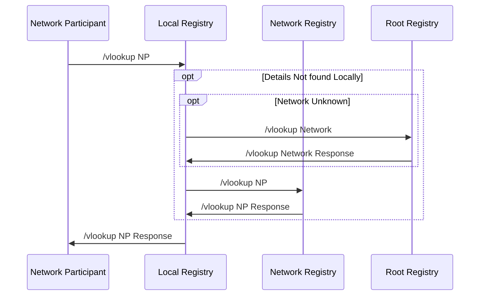

# network-registry

some base line assumprtion:
- NP vlookup needs to be signed by the NP and will be validated againts a unique key under the TTL.
- vlookup can only include elements of context & header in a p2p transaction which are transaction agnostic
- counter party subcriber_id, ukId, domain(For Network_id/Domain), location
- considering 2 header values will result into unique in a Network Registry but this somewhere also centralizes is a limitation

examples below
one illustration of the architecture where in the factors considered are the Registry would look out to the known parent not here we will try to evaluate the posibility by some comparesion and certain underlined assumtion of DNS registry enabled modal

In a DNS Server the search has few layers based on the address it is trying to identify like for www.ondc.org and here there are possible 3 recurtion but in the case of the beckn protocol the recurtion itself enables endless governance and inter registry by nature considering the avalabikity of domain and location   

